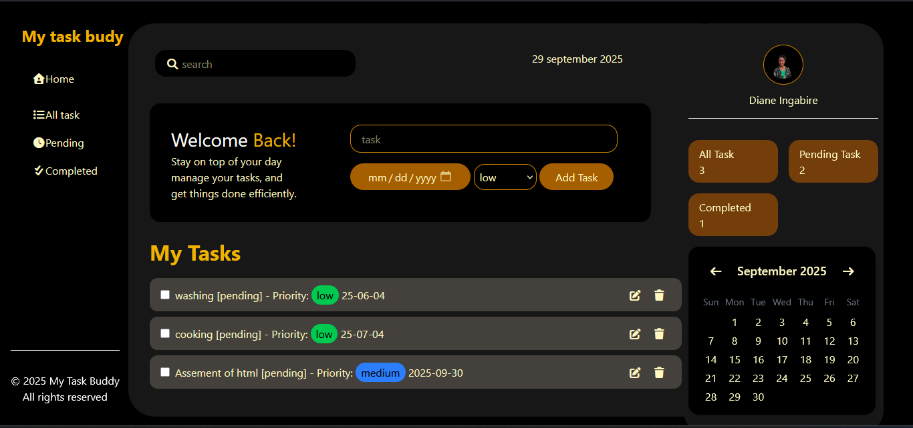

#  My Task Buddy

**My Task Buddy** is a simple and elegant Task Management web application designed to help users stay organized.  
It allows you to **add, view, filter, and manage tasks** efficiently in a clean, responsive interface.

##  Features

-  Add new tasks with a name, due date, and priority level  
- Filter tasks by status: **All**, **Pending**, or **Completed**  
-  Edit or delete existing tasks  
-  Calendar display to help you plan your tasks  
-  Task count cards (All, Pending, Completed)  
-  Responsive layout built with **Tailwind CSS**

##  Screenshot

Here’s how the interface looks:



##  Technologies Used

- **HTML5**  
- **Tailwind CSS**  
- **JavaScript (Vanilla)**  
- **Font Awesome** (for icons)

## Folder structure 

```bash
task-management-dashboard/
├── index.html
├── README.md
├── assets/
│   ├── index.js
│   └── images/
│       ├── image.png
│       └── my.png

```

##  How to Run Locally

1. Clone the repository:

   ```bash 
   git clone https://github.com/ingdia/task-management-dashboard.git 
   
   ```


2. Open the project folder:

```bash
cd task-management-dashboard

```
3. Open index.html in your browser or use Live server — that’s it!


